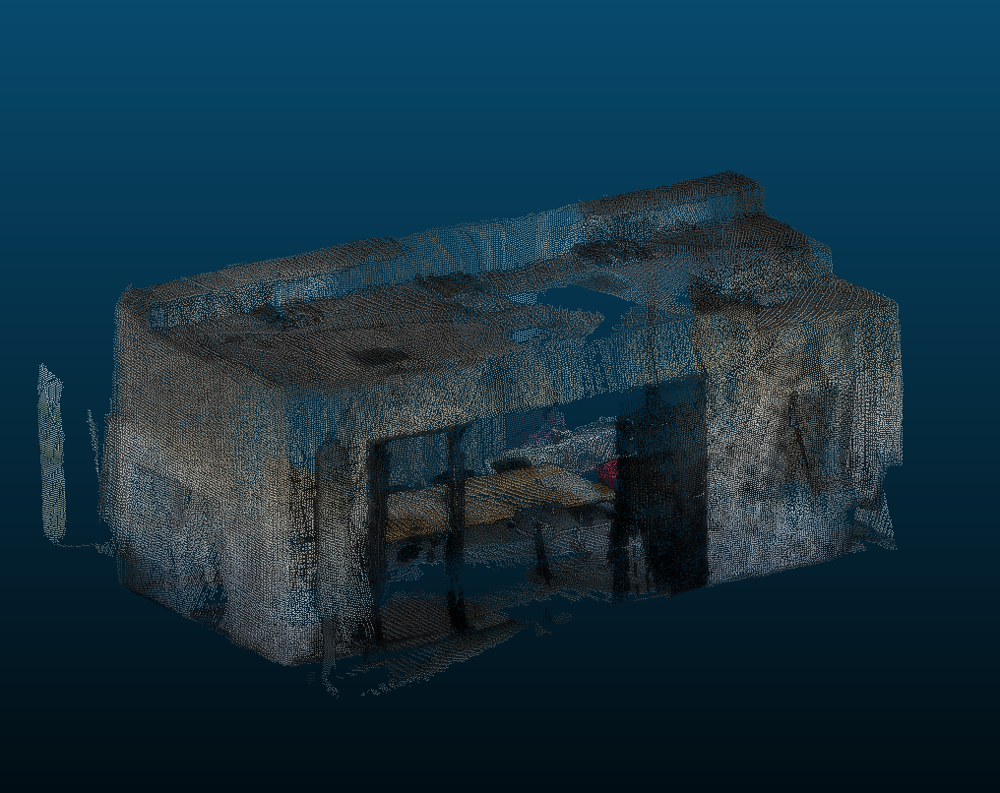
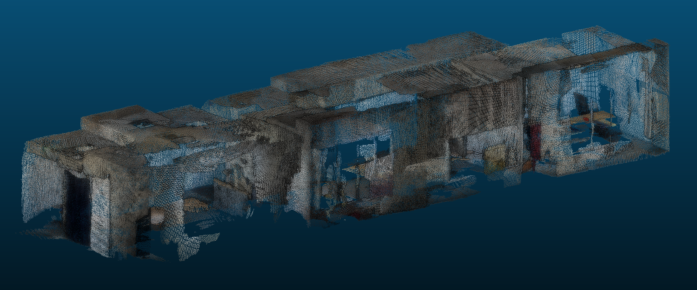
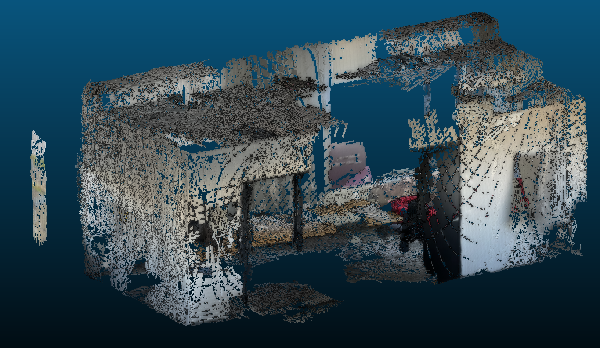
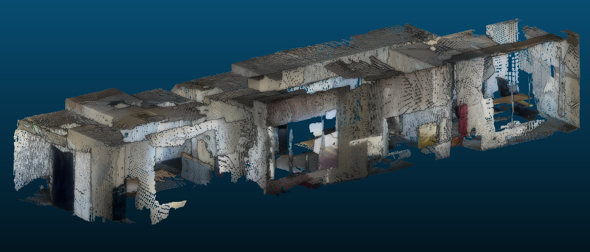
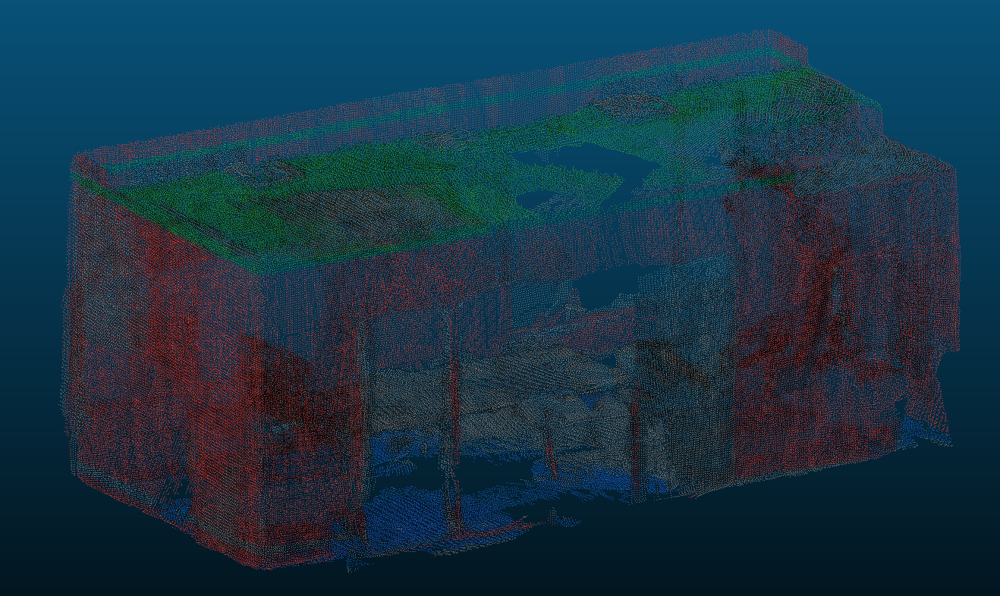
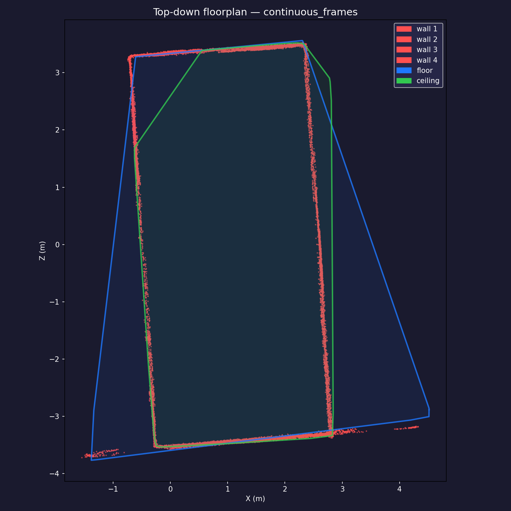
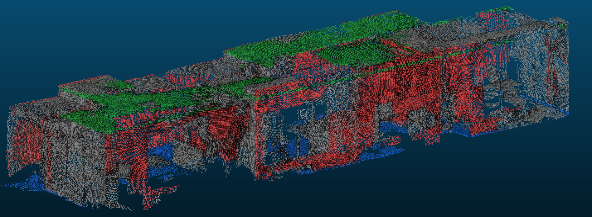
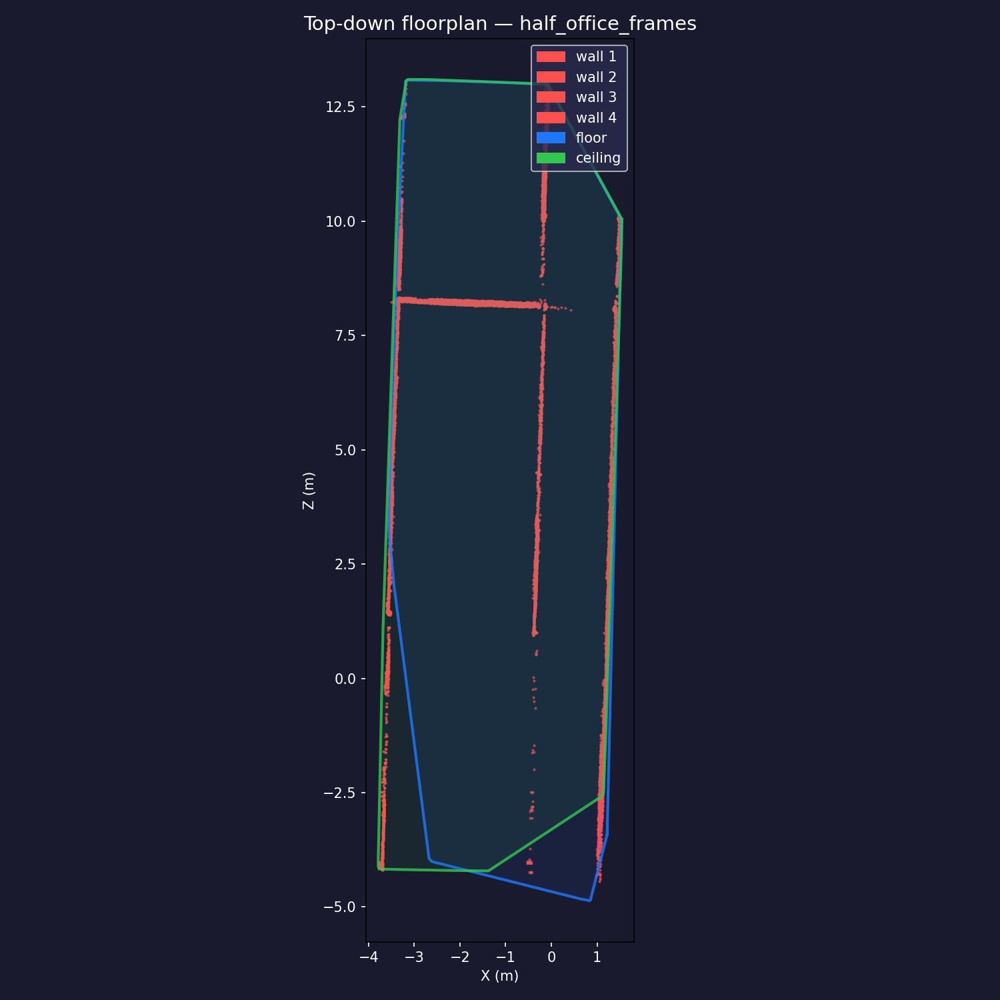

# Rendin CV Engineer Task — 3D Room Reconstruction from ARKit Scans

---

## Stages & Results

Three self-contained pipeline stages, each a single Python script taking a dataset name as its argument.

### Stage 1 — Point Cloud (`stage1_pointcloud_hq.py`)

Back-projects every depth frame into a shared world-space RGB point cloud.

| Dataset | Raw points | After voxel+SOR | After CC filter |
|---|---|---|---|
| `continuous_frames` (91 frames) | 1,675,001 | 502,864 | 501,440 |
| `half_office_frames` (185 frames) | 3,844,436 | 1,150,586 | 1,150,197 |

### Stage 2 — Surface Mesh (`stage2_mesh.py`)

Triangulates the point cloud with Ball-Pivoting Algorithm (BPA) via PyMeshLab.

| Dataset | Vertices | Faces |
|---|---|---|
| `continuous_frames` | 365,016 | 574,133 |
| `half_office_frames` | 1,043,194 | 1,884,223 |

### Stage 3 — Structural Planes (`stage3_planes.py`)

Fits floor, ceiling, and walls via iterative RANSAC. Reports surface areas via rotating-calipers minimum bounding rectangle (correct even when scan corners are missing). Also writes a top-down floorplan PNG and a noise-cropped point cloud.

**continuous_frames** — single room
| Surface | Area (m²) |
|---|---|
| Floor | 41.09 |
| Ceiling | 24.11 |
| Wall 1 | 21.20 |
| Wall 2 | 19.09 |
| Wall 3 | 17.87 |
| Wall 4 | 9.28 |
| **Total walls** | **67.44** |

**half_office_frames** — office space
| Surface | Area (m²) |
|---|---|
| Floor | 88.15 |
| Ceiling | 85.59 |
| Wall 1 | 52.47 |
| Wall 2 | 47.63 |
| Wall 3 | 40.92 |
| Wall 4 | 14.28 |
| **Total walls** | **155.30** |

> Areas vary slightly between runs due to RANSAC randomness (~1–2 m²). Ceiling in the continuous-frames scan is smaller than the floor because the LiDAR coverage of the ceiling was incomplete.

---

## Screenshots

### Stage 1 — RGB point clouds

| Continuous room | Half-office |
|---|---|
|  |  |

### Stage 2 — Surface mesh

| Continuous room | Half-office |
|---|---|
|  |  |

### Stage 3 — Structural planes & floorplans

| Continuous room — coloured planes | Floorplan |
|---|---|
|  |  |

| Half-office — coloured planes | Floorplan |
|---|---|
|  |  |

---

## How to Run

**OS:** macOS 15 (Apple Silicon, ARM). Not tested on Linux/Windows.

**Python:** 3.14.3 via Homebrew (`/opt/homebrew/bin/python3.14`)

**Install dependencies:**
```bash
pip install numpy==2.4.3 scipy==1.17.1 Pillow==12.2.0 pillow-heif==1.3.0 \
            scikit-image==0.26.0 matplotlib==3.10.9 pymeshlab==2025.7.post1
```

**Run all stages for both datasets:**
```bash
python3 stage1_pointcloud_hq.py continuous_frames
python3 stage1_pointcloud_hq.py half_office_frames

python3 stage2_mesh.py continuous_frames
python3 stage2_mesh.py half_office_frames

python3 stage3_planes.py continuous_frames
python3 stage3_planes.py half_office_frames
```

Outputs land in `output/`. Stage 1 takes ~30 s per dataset. Stage 2 takes 1–3 min. Stage 3 takes ~20 s.

**Expected output files:**
```
output/
  stage1_{dataset}_hq.ply          # RGB point cloud
  stage2_{dataset}_mesh.ply        # triangulated mesh
  stage3_{dataset}_planes.ply      # colour-coded planes, noise-cropped
  stage3_{dataset}_clean.ply       # original RGB, noise-cropped
  stage3_{dataset}_floorplan.png   # top-down floorplan
```

---

## Key Decisions

**Stage 1 — confidence ≥ 2 (high only).**  
ARKit LiDAR confidence 0/1 includes mixed pixels at depth discontinuities and edge noise. Keeping only confidence=2 cuts point count ~30% and meaningfully reduces flying-pixel artefacts at object boundaries.

**Stage 1 — coordinate frame.**  
ARKit uses an OpenGL camera convention: +X right, +Y up, −Z forward. World Y is gravity-aligned up. Back-projection therefore uses `z_cam = −depth` (depth is the positive perpendicular distance along the optical axis) and `y_cam = (cy − v) × d / fy` (image v increases downward, camera +Y is upward). Getting both signs wrong produces a mirrored, upside-down cloud.

**Stage 1 — HEIC orientation.**  
`pillow_heif` automatically applies the EXIF orientation tag embedded by iOS, delivering a portrait-layout array (H=960, W=720). A single `np.rot90(arr, k=1)` restores the sensor-native landscape layout (H=720, W=960) that the depth map is registered to.

**Stage 1 — post-processing: voxel downsample → SOR → voxel CC filter.**  
Voxel downsample (2 cm) collapses near-duplicate points from frame overlap. Statistical outlier removal (k=10, 1.5σ) removes thin wisps. A voxel-based connected-components filter (30 cm grid, 6-connectivity) keeps only the largest spatial cluster, discarding the small floating blobs that arise from scanning through doorways or windows.

**Stage 2 — Ball-Pivoting Algorithm (BPA).**  
Screened Poisson reconstruction crashes at every depth setting on ARM Mac with PyMeshLab 2025.7. BPA runs successfully and naturally preserves per-vertex RGB (it reuses the original cloud vertices as mesh vertices). The tradeoff is that BPA leaves holes in under-sampled regions (large flat surfaces such as the floor look patchy) whereas Poisson would produce a watertight surface. A TSDF + Marching Cubes alternative was tested but produced visibly worse geometry due to imperfect normal estimation, so BPA was kept.

**Stage 3 — subsampled RANSAC.**  
Running RANSAC on the full 500K-point cloud took 7+ minutes per plane (killed after timing out). Subsampling to 30K points for the RANSAC search, then counting and refitting inliers on the full cloud, reduces per-plane time to ~3 s with negligible accuracy loss.

**Stage 3 — floor/ceiling disambiguation via MIN_HORIZ_PTS.**  
RANSAC occasionally picks a small patch (bookshelf top, doorframe) as a horizontal plane before the real floor or ceiling. Requiring at least 20,000 inliers before a horizontal plane can be labelled floor/ceiling suppresses these spurious classifications. Planes below the threshold are left unclassified (grey).

**Stage 3 — minimum bounding rectangle for area.**  
Convex-hull area underestimates rectangular rooms when scan corners are missing — the hull shrinks away from unscanned corners. Rotating-calipers MBR fits the tightest axis-aligned rectangle at every hull-edge orientation and gives a stable area estimate regardless of corner coverage.

**Stage 3 — plane-based noise crop.**  
After fitting all structural planes, any point that lies more than 20 cm outside any bounding plane (floor, ceiling, wall) is discarded. The "inside" direction for each plane is determined by the centroid of all classified inliers. This removes hallway/corridor points that survived the CC filter because they were physically connected to the room through a doorway.

---

## Assumptions and Limitations

- **Single dominant room.** The CC filter and plane classifier assume one main convex room. Multi-room scans (e.g., L-shaped floor plans) will merge everything into one component and may detect spurious planes at room junctions.
- **Rectangular floor/ceiling.** MBR area is correct only if the room is roughly rectangular. An L-shaped room will be overestimated.
- **Max 8 planes.** `N_PLANES = 8` is hardcoded. Rooms with more distinct walls (alcoves, pillars) will have some surfaces left unclassified.
- **RGB–depth alignment is nearest-neighbour.** The depth (192×144) and RGB (960×720) have different resolutions and fields of view. Points are coloured by nearest-pixel lookup; there is no sub-pixel bilinear interpolation or field-of-view correction for the colour camera.
- **No loop closure or bundle adjustment.** Each frame is registered independently using the ARKit-provided `worldFromCamera` pose. Drift in long scans (e.g., `half_office_frames`) is inherited from ARKit and not corrected.
- **BPA mesh has holes.** Flat surfaces (floor, ceiling) are sparsely sampled and the BPA mesh is not watertight. This is acceptable for visualisation but not for fabrication or physics simulation.
- **Stage 2 is not semantically aware.** The mesh is a raw triangulation of the full cloud; it does not distinguish floor from wall from furniture.

---

## What Went Wrong

**Back-projection coordinate signs** — the initial implementation used `z_cam = +depth` and `y_cam = (v − cy) × d / fy`, producing a mirrored, vertically-flipped cloud that looked like coloured noise. Diagnosed by computing where a centre-pixel point at 2 m depth should land and comparing to actual output.

**HEIC orientation** — `pillow_heif` silently applies the iOS EXIF rotation, so the loaded image array is 90° rotated relative to the depth frame. Discovered by overlaying RGB colours on the point cloud and seeing them shifted by one axis. Fixed with a single `np.rot90`.

**Screened Poisson segfault** — `generate_surface_reconstruction_screened_poisson()` in PyMeshLab 2025.7 on ARM Mac crashes at every depth parameter (6–9). Switched to BPA. A TSDF + Marching Cubes approach was also implemented (`stage2_mesh_solid.py`) but produced worse visual results than BPA and was abandoned.

**RANSAC timeout** — first implementation ran RANSAC over all 500K points; one plane took 7+ minutes and was killed. Fixed by subsampling to 30K for the search phase.

**Connected-components OOM** — first CC implementation called `cKDTree.query_pairs(0.15)` on 500K points, which materialised ~44 M pairs into memory (≈2.6 GB). The process was killed after 45 minutes. Replaced with a voxel-grid approach that builds a 6-connected graph on ~1,600 occupied voxels instead.

**Hash collision in voxel CC** — the replacement CC filter encoded (ix, iy, iz) as `ix*1_000_000 + iy*1_000 + iz` and decoded via integer division. Python's floor-division and modulo for negative dividends do not round toward zero, so decoding was wrong for negative coordinates, making the room appear fragmented into 24 disconnected pieces (132K of 502K points retained). Fixed by normalising voxel coordinates to non-negative before encoding.

---

## Input Data — Understanding

Each frame consists of four synchronised files:

| File | Type | Content |
|---|---|---|
| `frame_XXXXXX.depth_u16.bin` | uint16 LE, 192×144 | Perpendicular depth in millimetres. Value 0 = invalid. |
| `frame_XXXXXX.conf_u8.bin` | uint8, 192×144 | ARKit LiDAR confidence: 0=low, 1=medium, 2=high. |
| `frame_XXXXXX.rgb.heic` | HEIC | Colour frame from the main camera (960×720 after EXIF rotation). |
| `frame_XXXXXX.json` | JSON | Camera intrinsics, `worldFromCamera` extrinsic, resolution metadata, `trackingState`. |

**Coordinate frames:**
- *Camera frame*: +X right, +Y up, −Z forward (OpenGL / ARKit convention). Depth is always positive and measured along −Z.
- *World frame*: `worldFromCamera` is a column-major 4×4 rigid-body transform. World Y is gravity-aligned up. All frames share this coordinate system.
- *Image frame*: pixel (u, v) with u increasing right, v increasing down. Back-projection therefore flips the v axis: `y_cam = (cy − v) × d / fy`.

**Failure modes:**
- `trackingState != "normal"` — ARKit has not yet initialised or has lost tracking. The `worldFromCamera` pose is unreliable; these frames are skipped.
- `depth == 0` — sensor returned no measurement for that pixel (occluded, too close, or specular surface). Treated as NaN and masked out.
- `confidence < 2` — mixed pixels at depth discontinuities (one sensor ray straddles a foreground and background object) and IR-transparent materials. Keeping only confidence=2 removes most flying-pixel artefacts.
- Intrinsics reference resolution — the JSON intrinsics are calibrated at 1920×1440. Depth is 192×144 (exactly 1/10 scale). Failing to scale fx, fy, cx, cy produces a cloud compressed or stretched by 10×.

---

## Future Improvements

**Stage 1 — Point cloud**
- *Proper RGB–depth alignment.* Currently colour is assigned by nearest-pixel lookup. The depth and RGB cameras have different fields of view and principal points; a full homography or per-pixel reprojection would eliminate the colour fringing visible at depth discontinuities.
- *Temporal depth averaging.* Multiple frames observe the same surface point from slightly different angles. Averaging depth estimates per voxel (weighted by confidence) would reduce noise more effectively than SOR.
- *Loop closure / pose correction.* ARKit pose drift accumulates over longer scans. Running a lightweight ICP or pose-graph optimisation over the accumulated cloud would tighten registration, especially for `half_office_frames`.

**Stage 2 — Mesh**
- *Switch to Open3D.* Open3D's Poisson reconstruction is stable on ARM Mac and produces watertight, hole-free meshes. PyMeshLab was used here only because Open3D was not in the original environment; replacing it is a one-file change.
- *Semantic-aware reconstruction.* Use the Stage 3 plane fits to reconstruct floor, ceiling, and walls as clean analytical planes rather than triangulated point samples. Apply BPA only to furniture and objects. This would give perfectly flat floors/ceilings with no holes.
- *Hole filling.* BPA leaves gaps in sparsely scanned areas. A simple hole-filling pass (e.g., `meshing_close_holes` in PyMeshLab) would improve visual quality.

**Stage 3 — Planes**
- *Non-rectangular rooms.* MBR area overestimates L-shaped or irregular floor plans. A concave-hull (alpha-shape) area would be more accurate for non-convex rooms.
- *Door and window detection.* Gaps in wall plane inliers correspond to openings. Analysing the inlier coverage pattern per wall could automatically locate and report door/window positions and sizes.
- *Multi-room support.* The current CC filter merges all connected geometry into one component. Splitting by structural planes before filtering would allow multi-room scans to be segmented per room.
- *Learning-based plane detection.* Classical RANSAC is sensitive to the number-of-planes parameter and misses curved or cluttered surfaces. A network such as PlaneTR or PlaneRCNN would generalise better to complex scenes.
